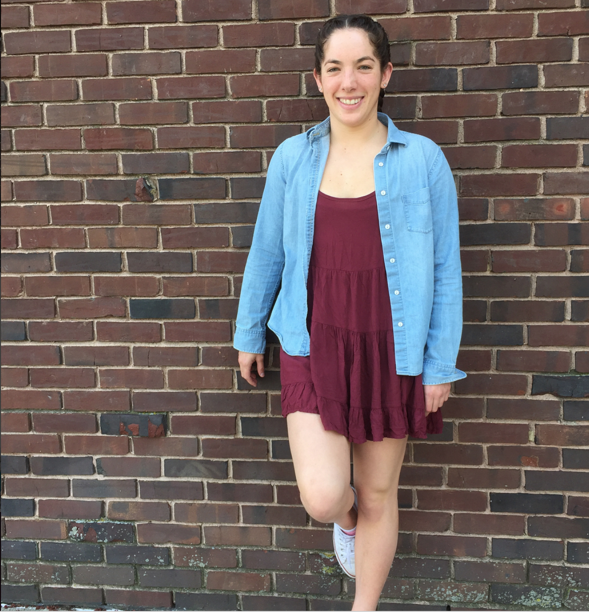

# Abby Bergman 

## Background
#### I am from Los Angeles, California and have spent four years living in Western Massachusetts. I have a sister and a cat. 

## Education
#### I am a MAPSS student concentrating in **Psychology**. My research interests center around *motivation*, *decision making*, and *goals*. I completed my undergraduate education in **Neuroscience** and **Exercise and Sports Studies** at [Smith College](http://www.smith.edu), where I also competed on the varsity swim team. 

## Interests
#### I am fairly obsessed with swimming and will be volunteer coaching here at U of C. I am a marathon swimmer and details of some of my swims are located [here](http://abbybergman/com). 