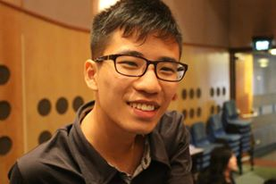

# hw01
Repository for homework 01

## Self-Introduction for **Chi Chian Lee**

****

> *Chi Chian is an incoming first year MA student at the Committee of International Relations. He is interested in how identity politics influence geopolitics, specifically in the Northeast Asian region. During his free time, Chi Chian reads cooking recipes and avoids physical exercise in the gyms.*

## Quick Facts
- **Nationality: **Singaporean
- **Education Background: ** LLB. International Politcs, Peking University, 2018.
- **Hobbies: **Watching cooking shows, video games and *Go(a Chinese board games)*
- **Favorite foods:** Spicy, spicy and spicy food
- **TV shows: ** The Big Bang Theory and Harry Potter series

****
Homework 01 by Chi Chian Lee, 26 September 2018. Add me on [Instagram](https://www.instagram.com/chichian93/) or [Facebook](https://www.facebook.com/LCC.xEvo)!