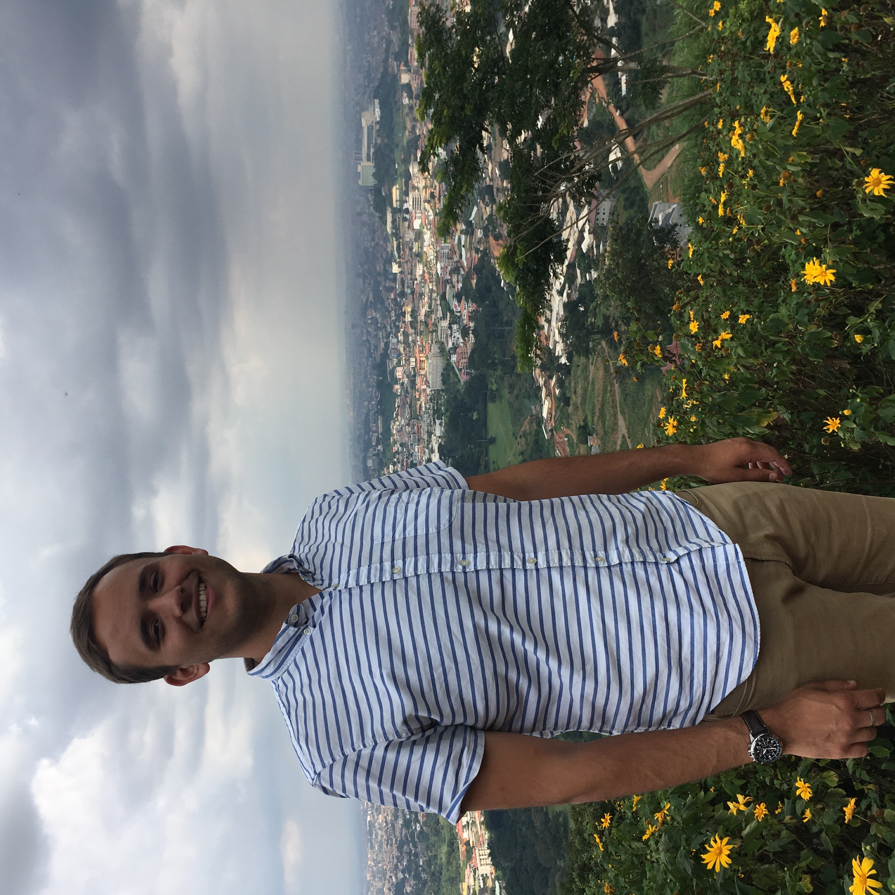

# hw01
Repository for homework 01
# Isaac LaGrand
I am an MA student in International Relations.
My favorite non-fiction book is *Nature's Metropolis: Chicago and the Great West*
I am taking three courses this term. Ranked from Earliest to latest in the day they are:
1. International Political Economy
2. Price Theory 1
3. Computing for the Social Sciences
This is a picture of me in Cameroon this summer
image: 
I worked for a political organization called the [Coalition of Justice Voters](www.justicevoters.org) after college.