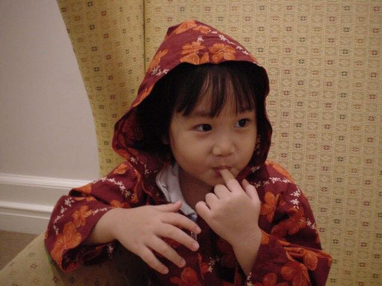

# hw01
Repository for homework 01

# Biography of Mint

### The Origin of Mint
  
image:

**Full Name** : *Wanitchaya Poonpatanapricha*  
**Birthday** : *30 July 1998*  
**Nationality** : *Thai*  
**Blood Group** : *O*  
**Gender** : *Female*  
**Hometown** : *Bangkok, Thailand*  
**Sibling(s)** : *One 2-year-younger sister*  
**Personality** : *Introvert*  
  
image:

  
  
  ### The Present Mint
  

image:

  
  
### Facts about Mint
##### Hobbies
  * Ballroom Dancing
  * Music
    - *Piano*
    - *Clarinet*
    - a little bit of *Violin*
  * Yoga
  
##### Things Mint likes
  * The Sea and the Beach
  * Movies
    - *About Time*
    - *Devil Wears Prada*
    - *Mamma Mia*
  * Love-Fantasy Novels
  * Children Literatures
    - *The Chronicle of Narnia*
    - *The Little Prince*
    - *Ooki Ichinensei to Chiisana Ninensei*
  * Quote
        
> Grown-ups never understand anything by themselves, and it is tiresome for children to be always and forever explaining things to them ― *Antoine de Saint-Exupéry, The Little Prince*

### Mint Online
  * [Facebook][1]
  * [LinkedIn][2]

[1]: https://www.facebook.com/mintwanitchaya
[2]: https://www.linkedin.com/in/wanitchaya-poonpatanapricha-631b20131/
