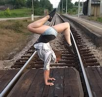

# My Bio

---

> Everything
> is better upside down!

  

### Basics

**Name:** Sanja Miklin  
ฅʕ•̫͡•ʔฅ *(note: the name is Croatian, it rhymes with 'lasagna')*  
**Program:** Comparative Human Development  
**Dissertation Topic:** Production of Knowledge About Suicide  

### Extras

In my free time, I do a whole lot of things, such as: 

 - Dancing
    1. Salsa
    2. Bachata
    3. West Coast Swing
 - Circus Arts  **ᕙ(⇀‸↼‶)ᕗ**
    - Partner Acrobatics
    - Cyr Wheel
    - Contortion
 - Dessert making and crafting
 
To learn more, see my [website](http://sanjamiklin.com) or find me on [youtube](https://www.youtube.com/user/namayani/)!

