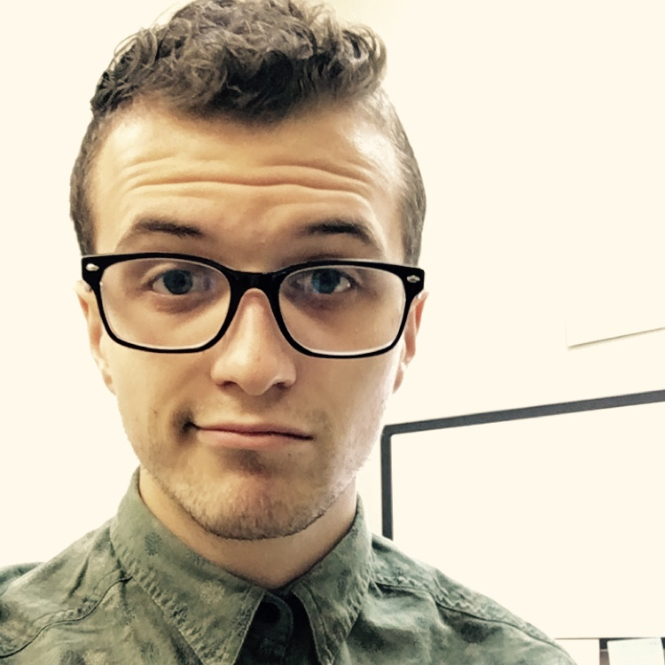

# hw01 - Wesley Meredith

I'm Wesley, and I'm in the MAPSS program as a means to steer closer into my desired of specialization in Neuroscience. Most my research experience in undergrad and afterward has been in visual processing and perception, _however_ I'm interested in pursuing topics of developmental social neuroscience related to experiences of early life stress and trauma.

## General Timeline
-October, 1992: Born in rural Virginia
-May, 2015: Graduated from University of Richmond
-July, 2015: Moved to CA to be lab manager of a Vision Neuroscience Lab at Stanford
-September, 2018: Moved to IL to attend University of Chicago

## Academic Profile
For a general overview of my research experiences, check out my [ResearchGate profile](https://www.researchgate.net/profile/Wesley_Meredith).

## Non-Academic Interests
-Reading, Science Fiction and Nonfiction
-Bike Riding
-Cooking and Bread Baking
-Listening to Podcasts

__Miscellaneous: please use they/them pronouns or my first name for me__